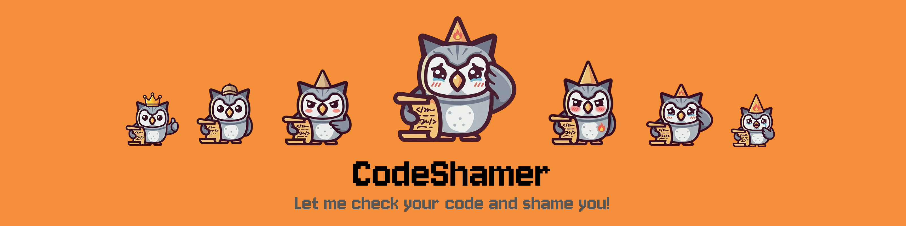

<div align="start">
  <a href="./README.md">EN</a>  | <span>ES</span> 
</div>

<br/>

<p align="center">
  
</p>

<h1 align="center">🔥 CodeShamer</h1>

<p align="center">
  <em>La extensión de VS Code que detecta malos patrones de programación y te da un buen repaso para que escribas código mejor.</em>
</p>

<p align="center">
<!-- TODO before publishing: replace YOUR_PUBLISHER_ID and charlymech/code-shamer with real values, then uncomment these badges -->
  <!-- <a href="https://marketplace.visualstudio.com/items?itemName=YOUR_PUBLISHER_ID.code-shamer"></a> -->
  <!-- <a href="https://marketplace.visualstudio.com/items?itemName=YOUR_PUBLISHER_ID.code-shamer"></a> -->
  <!-- <a href="https://marketplace.visualstudio.com/items?itemName=YOUR_PUBLISHER_ID.code-shamer"></a> -->
  <!-- <a href="https://open-vsx.org/extension/YOUR_PUBLISHER_ID/code-shamer"></a> -->
  <!-- <a href="https://github.com/charlymech/code-shamer/actions"></a> -->
  <!-- <a href="https://github.com/charlymech/code-shamer/releases"></a> -->
  <a href="LICENSE"></a>
  
  
</p>

---

> _"Tu código tiene más banderas rojas que un desfile soviético."_ — CodeShamer, probablemente

**CodeShamer** escanea todo tu espacio de trabajo en busca de malos patrones de programación — registros de depuración olvidados en producción, minas terrestres de seguridad, violaciones de estilo, y más — y luego te critica con humor por ello. Es como una revisión de código de ese colega brutalmente honesto que, de alguna manera, también es muy gracioso.

---

## Lo Que Detecta

CodeShamer detecta patrones que no deberían estar en código de producción, agrupados en seis categorías:

-  **Seguridad** — funciones peligrosas, vectores de inyección, secretos "hardcodeados"
-  **Restos de depuración** — llamadas de registro (logging), sentencias `debugger`, funciones de ayuda para inspección
-  **Estilo** — sintaxis obsoleta, comparaciones débiles, problemas de legibilidad
-  **Fiabilidad** — excepciones ignoradas silenciosamente, afirmaciones de tipo inseguras, riesgos de nulos
-  **Rendimiento** — patrones de ineficiencia conocidos en bucles y subprocesos (threading)
-  **Deuda de mantenimiento** — comentarios de marcado (`TODO`, `FIXME`, `HACK`) y advertencias silenciadas

A través de **8 lenguajes**: JavaScript, TypeScript, Python, Java, C, C++, Dart, PHP.

---

## Cómo Funciona

### 🔎 Escaneo de Todo el Espacio de Trabajo

CodeShamer escanea **todo tu proyecto** automáticamente al iniciar y cada vez que guardas. Los resultados se guardan en caché: solo se vuelven a analizar los archivos modificados.

### 📊 Panel del Reporte de Vergüenza

Haz clic en el icono de la llama en la Barra de Actividad para abrir tu **Reporte de Vergüenza**:

-  Tu **nivel de vergüenza** actual y puntuación
-  Desglose por categoría (depuración, seguridad, estilo…)
-  Cada archivo infractor con detalles desplegables
-  **Haz clic en cualquier vergüenza → salta directamente a la línea**

### ⚠️ Integración con el panel de Problemas

Todas las vergüenzas aparecen en el panel integrado de **Problemas** de VS Code (`Ctrl+Shift+M`), igual que los errores de ESLint o TypeScript. Pasa el cursor para ver detalles, haz clic para navegar.

### ⚡ Soluciones Rápidas en un Clic

Coloca el cursor sobre una línea marcada y presiona `Ctrl+.` / `Cmd+.`:

| Patrón             | Solución        |
| ------------------ | --------------- |
| `var x = 1`        | → `let x = 1`   |
| `a == b`           | → `a === b`     |
| `a != b`           | → `a !== b`     |
| `debugger`         | → _(eliminado)_ |
| `console.log(...)` | → _(eliminado)_ |

### 🔥 Roasts y Niveles de Vergüenza

Después de cada escaneo, CodeShamer te da una puntuación y te suelta una frase sarcástica (roast):

| Puntuación | Nivel | Roast |
| --- | --- | --- |
| 0 | ✨ Gurú del Código Limpio | _"Impecable. ¿Escribiste esto o un linter alcanzó la consciencia?"_ |
| 5+ | 💻 Como un Hacker | _"Algunas asperezas, pero nada por lo que perder el sueño."_ |
| 25+ | 🧑‍💻 Nivel Seniority | _"Funciona, pero se mantiene unido con cinta americana y oraciones."_ |
| 75+ | 👶 Como un Junior | _"Este código no necesita una revisión, necesita una intervención."_ |
| 150+ | 🙈 Vive Coder | _"Me he quedado sin cosas constructivas que decir."_ |
| 300+ | 🔥 Señor de la Vergüenza | _"¿Esto es código o un grito de ayuda?"_ |

### 🏆 Sistema de Logros

Gana logros a medida que limpias tu código: **First Glance** (Primer Vistazo), **First Fix!** (¡Primera Solución!), **Halfway There!** (¡A Mitad de Camino!), **Clean Slate** (Borrón y Cuenta Nueva), **Persistent Improver** (Mejorador Persistente).

---

## Lenguajes Soportados

| Lenguaje | Reglas | Destacados |
| --- | :-: | --- |
| **JavaScript / JSX** | 12 | `console.*`, `eval`, `var`, `==`, `debugger`, `alert` |
| **TypeScript / TSX** | 18 | Todas las reglas de JS + `: any`, `as any`, `@ts-ignore`, `@ts-nocheck` |
| **Python** | 10 | `print()`, `except` vacío, `import *`, `eval`, contraseñas hardcodeadas |
| **Java** | 9 | `System.out`, catch vacío, tipos crudos (raw types), `Thread.sleep` |
| **C++** | 10 | `printf`, `gets`, `goto`, `strcpy`, `using namespace std` |
| **C** | 8 | `printf`, `gets`, `sprintf`, `strcpy`, `strcat`, `void*` |
| **Dart** | 6 | `print`, `dynamic`, desempaquetado forzado, `debugPrint` |
| **PHP** | 10 | `var_dump`, `eval`, `mysql_*`, `extract`, `$$variables` |

Además de **reglas multiplataforma** para todos los anteriores: marcadores `TODO`, `FIXME`, `HACK`, `XXX`.

---

## Configuración

Abre la Configuración (`Ctrl+,`) y busca **"CodeShamer"**:

| Ajuste | Por defecto | Descripción |
| --- | --- | --- |
| `codeShamer.enable` | `true` | Activar / desactivar la extensión |
| `codeShamer.enableRoasts` | `true` | Mostrar mensajes sarcásticos (roasts) después de los escaneos |
| `codeShamer.enabledLanguages` | todos | Lenguajes a analizar |
| `codeShamer.severityThreshold` | `1` | Severidad mínima para mostrar (`1` = todas, `5` = solo críticas) |
| `codeShamer.excludePatterns` | varios | Patrones glob para rutas a omitir |
| `codeShamer.scanOnSave` | `true` | Volver a escanear al guardar un archivo |
| `codeShamer.maxFilesToScan` | `5000` | Máximo de archivos por escaneo del espacio de trabajo |
| `codeShamer.disabledRules` | `[]` | IDs de reglas a silenciar por completo |

**Silenciar reglas específicas:**

```json
{
	"codeShamer.disabledRules": ["common-todo", "js-console-log"]
}
```

Los IDs de las reglas son visibles en el panel de Problemas y en la barra lateral del Reporte de Vergüenza.

**Excluidos por defecto** (no se necesita configuración): `node_modules`, `dist`, `build`, `.astro`, `.next`, `.nuxt`, `.svelte-kit`, `.cache`, `.turbo`, `.git`, `.claude`, `.cursor`, `.idea`, y más.

---

## Comandos

Abre la Paleta de Comandos (`Ctrl+Shift+P`):

| Command | Descripción |
| --- | --- |
| `CodeShamer: Scan Workspace` | Activar manualmente un escaneo completo |
| `CodeShamer: Show Shame Panel` | Abrir la barra lateral del Reporte de Vergüenza |
| `CodeShamer: Clear Cache` | Forzar un escaneo limpio en la próxima ejecución |

---

## Ignorar Líneas Específicas

A veces un `console.log` es intencional. Suprímelo en la misma línea:

```javascript
// code-shamer-ignore-next-line
console.log("intentional — tracking user session start");

eval(trustedInput); // code-shamer-ignore
```

Funciona en todos los lenguajes usando su sintaxis de comentarios nativa (//, #, --).

---

## Pruébalo Localmente

Puedes compilarla e instalarla localmente en unos pocos pasos:

```bash
git clone https://github.com/charlymech/code-shamer.git
cd code-shamer
pnpm install && pnpm run compile
```

Luego presiona la tecla F5 en tu teclado y abre un proyecto que use los lenguajes configurados.

Guía completa paso a paso con capturas de pantalla y solución de problemas: **[GETTING_STARTED.md](docs/es/GETTING_STARTED.md)**

---

## Roadmap / Próximamente 🚀

Seguimos trabajando para hacer que CodeShamer sea aún más despiadado. Esto es lo que tenemos planeado para futuras versiones:

- **Underlined Shames**: Mejoras en las decoraciones del editor (subrayado) para indicar exactamente qué parte de la línea ha provocado la vergüenza.
- **Split View for Shame Actions**: Una interfaz interactiva de vista dividida (split view) directamente desde el menú de Quick Fix (Acciones Rápidas) para previsualizar cómo quedará tu código tras aplicar los arreglos.
- **Git Blame Integration**: Detección automática de *quién* escribió el código desastroso para incluir su `@usuario` de Git directamente en el roast de burla.
- **Custom Project Rules (`.codeshamerrc`)**: Define reglas específicas para tu equipo o proyecto comprobando mediante Regex (Expresiones Regulares) las convenciones propias.
- **Framework-Specific Shaming**: Soporte nativo y reglas avanzadas para Angular, Vue, Spring Boot, React Native & Expo, ¡y muchos más!

---

## Contribuir

CodeShamer es de código abierto y las contribuciones son bienvenidas — especialmente nuevas reglas de lenguaje.

| Archivo |  |
| --- | --- |
| [GETTING_STARTED.md](docs/es/GETTING_STARTED.md) | Instalar y usar localmente |
| [CONTRIBUTING.md](docs/es/CONTRIBUTING.md) | Issues, PRs, añadir lenguajes |
| [ADDING_LANGUAGES.md](docs/es/ADDING_LANGUAGES.md) | Paso a paso: añadir un nuevo lenguaje |
| [ARCHITECTURE.md](docs/es/ARCHITECTURE.md) | Funcionamiento interno del código y CI/CD |
| [CODE_OF_CONDUCT.md](docs/es/CODE_OF_CONDUCT.md) | Pautas de la comunidad |
| [ABOUT_LICENSE.md](docs/es/ABOUT_LICENSE.md) | Sobre la licencia del proyecto |

---

## License

Lee [ABOUT_LICENSE.md](./docs/es/ABOUT_LICENSE.md) para más información sobre este proyecto.

---

<p align="center">
  © 2026 <strong>Carlos Sánchez Recio</strong> (<a href="https://github.com/charlymech">CharlyMech</a>) · Hecho con partes iguales de amor y fuego 🔥
</p>
