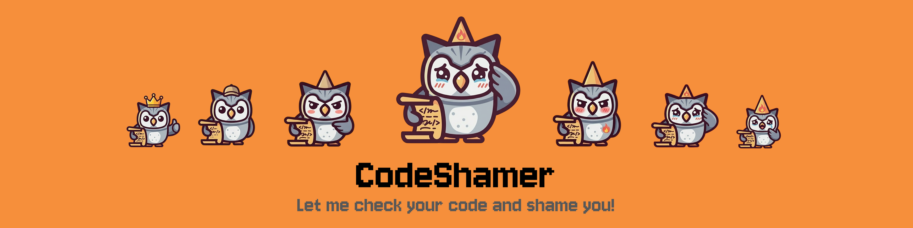

<div align="start">
  <span>EN</span> | <a href="./README.es.md">ES</a> 
</div>

<br/>

<p align="center">
  
</p>

<h1 align="center">🔥 CodeShamer</h1>

<p align="center">
  <em>The VS Code extension that detects bad coding patterns and roasts you into writing better code.</em>
</p>

<p align="center">
  <!-- TODO before publishing: replace YOUR_PUBLISHER_ID and charlymech/code-shamer with real values, then uncomment these badges -->
  <!-- <a href="https://marketplace.visualstudio.com/items?itemName=YOUR_PUBLISHER_ID.code-shamer"></a> -->
  <!-- <a href="https://marketplace.visualstudio.com/items?itemName=YOUR_PUBLISHER_ID.code-shamer"></a> -->
  <!-- <a href="https://marketplace.visualstudio.com/items?itemName=YOUR_PUBLISHER_ID.code-shamer"></a> -->
  <!-- <a href="https://open-vsx.org/extension/YOUR_PUBLISHER_ID/code-shamer"></a> -->
  <!-- <a href="https://github.com/charlymech/code-shamer/actions"></a> -->
  <!-- <a href="https://github.com/charlymech/code-shamer/releases"></a> -->
  <a href="LICENSE"></a>
  
  
</p>

---

> _"Your code has more red flags than a Soviet parade."_ — CodeShamer, probably

**CodeShamer** scans your entire workspace for bad coding patterns — debug logs left in production, security landmines, style violations, and more — then roasts you about it. It's like a code review from that brutally honest colleague who is also somehow hilarious.

---

## What It Catches

CodeShamer detects patterns that shouldn't be in production code, grouped into six categories:

-  **Security** — dangerous functions, injection vectors, hardcoded secrets
-  **Debug leftovers** — logging calls, debugger statements, inspection helpers
-  **Style** — outdated syntax, loose comparisons, readability issues
-  **Reliability** — swallowed exceptions, unsafe type assertions, null risks
-  **Performance** — known inefficiency patterns in loops and threading
-  **Maintenance debt** — marker comments (`TODO`, `FIXME`, `HACK`) and suppressed warnings

Across **8 languages**: JavaScript, TypeScript, Python, Java, C, C++, Dart, PHP.

---

## How It Works

### 🔎 Workspace-Wide Scan

CodeShamer scans your **entire project** automatically on startup and on every save. Results are cached — only changed files get re-analysed.

### 📊 Shame Report Panel

Click the flame icon in the Activity Bar to open your **Shame Report**:

-  Your current **shame level** and score
-  Breakdown by category (debug, security, style…)
-  Every offending file with expandable details
-  **Click any shame → jump straight to the line**

### ⚠️ Problems Panel Integration

All shames appear in VS Code's built-in **Problems panel** (`Ctrl+Shift+M`), just like ESLint or TypeScript errors. Hover for details, click to navigate.

### ⚡ One-Click Quick Fixes

Place your cursor on a flagged line and press `Ctrl+.` / `Cmd+.`:

| Pattern            | Fix           |
| ------------------ | ------------- |
| `var x = 1`        | → `let x = 1` |
| `a == b`           | → `a === b`   |
| `a != b`           | → `a !== b`   |
| `debugger`         | → _(removed)_ |
| `console.log(...)` | → _(removed)_ |

### 🔥 Roasts & Shame Levels

After every scan, CodeShamer gives you a score and drops a roast:

| Score | Level | Roast |
| --- | --- | --- |
| 0 | ✨ Clean Code Guru | _"Spotless. Did you write this or did a linter achieve sentience?"_ |
| 5+ | 💻 Like a Hacker | _"A few rough edges, but nothing to lose sleep over."_ |
| 25+ | 🧑‍💻 Seniority Level | _"It works, but it's held together with duct tape and prayers."_ |
| 75+ | 👶 Junior Like | _"This code doesn't need a review, it needs an intervention."_ |
| 150+ | 🙈 Vive Coder | _"I've run out of constructive things to say."_ |
| 300+ | 🔥 Shame Overlord | _"Is this code or a cry for help?"_ |

### 🏆 Achievement System

Earn achievements as you clean up your code: **First Glance**, **First Fix!**, **Halfway There!**, **Clean Slate**, **Persistent Improver**.

---

## Supported Languages

| Language | Rules | Highlights |
| --- | :-: | --- |
| **JavaScript / JSX** | 12 | `console.*`, `eval`, `var`, `==`, `debugger`, `alert` |
| **TypeScript / TSX** | 18 | All JS rules + `: any`, `as any`, `@ts-ignore`, `@ts-nocheck` |
| **Python** | 10 | `print()`, bare `except`, `import *`, `eval`, hardcoded passwords |
| **Java** | 9 | `System.out`, empty catch, raw types, `Thread.sleep` |
| **C++** | 10 | `printf`, `gets`, `goto`, `strcpy`, `using namespace std` |
| **C** | 8 | `printf`, `gets`, `sprintf`, `strcpy`, `strcat`, `void*` |
| **Dart** | 6 | `print`, `dynamic`, force unwrap, `debugPrint` |
| **PHP** | 10 | `var_dump`, `eval`, `mysql_*`, `extract`, `$$variables` |

Plus **cross-language rules** for all of the above: `TODO`, `FIXME`, `HACK`, `XXX` markers.

---

## Configuration

Open Settings (`Ctrl+,`) and search **"CodeShamer"**:

| Setting | Default | Description |
| --- | --- | --- |
| `codeShamer.enable` | `true` | Enable / disable the extension |
| `codeShamer.enableRoasts` | `true` | Show roast messages after scans |
| `codeShamer.enabledLanguages` | all | Languages to analyse |
| `codeShamer.severityThreshold` | `1` | Min severity to show (`1` = all, `5` = critical only) |
| `codeShamer.excludePatterns` | many | Glob patterns for paths to skip |
| `codeShamer.scanOnSave` | `true` | Re-scan on file save |
| `codeShamer.maxFilesToScan` | `5000` | Max files per workspace scan |
| `codeShamer.disabledRules` | `[]` | Rule IDs to silence entirely |

**Silencing specific rules:**

```json
{
	"codeShamer.disabledRules": ["common-todo", "js-console-log"]
}
```

Rule IDs are visible in the Problems panel and the Shame Report sidebar.

**Excluded by default** (no configuration needed): `node_modules`, `dist`, `build`, `.astro`, `.next`, `.nuxt`, `.svelte-kit`, `.cache`, `.turbo`, `.git`, `.claude`, `.cursor`, `.idea`, and more.

---

## Commands

Open the Command Palette (`Ctrl+Shift+P`):

| Command                        | Description                    |
| ------------------------------ | ------------------------------ |
| `CodeShamer: Scan Workspace`   | Manually trigger a full scan   |
| `CodeShamer: Show Shame Panel` | Open the Shame Report sidebar  |
| `CodeShamer: Clear Cache`      | Force a fresh scan on next run |

---

## Ignoring Specific Lines

Sometimes a `console.log` is intentional. Suppress it inline:

```javascript
// code-shamer-ignore-next-line
console.log("intentional — tracking user session start");

eval(trustedInput); // code-shamer-ignore
```

Works in all languages using their native comment syntax (`//`, `#`, `--`).

---

## Try It Locally

You can build and install it locally in a few steps:

```bash
git clone https://github.com/charlymech/code-shamer.git
cd code-shamer
pnpm install && pnpm run compile
```

Then press `F5` key on your keyboard and open a project that uses the configured languages.

Full walkthrough with screenshots and troubleshooting: **[GETTING_STARTED.md](docs/en/GETTING_STARTED.md)**

---

## Contributing

CodeShamer is open source and contributions are welcome — especially new language rules.

| Document |  |
| --- | --- |
| [GETTING_STARTED.md](docs/en/GETTING_STARTED.md) | Install and use locally |
| [CONTRIBUTING.md](docs/en/CONTRIBUTING.md) | Issues, PRs, adding languages |
| [ADDING_LANGUAGES.md](docs/en/ADDING_LANGUAGES.md) | Step-by-step: add a new language |
| [ARCHITECTURE.md](docs/en/ARCHITECTURE.md) | Code internals and CI/CD |
| [CODE_OF_CONDUCT.md](docs/en/CODE_OF_CONDUCT.md) | Community guidelines |
| [ABOUT_LICENSE.md](docs/en/ABOUT_LICENSE.md) | About this project's license |

---

## License

Read [BOUT_LICENSE.md](docs/enABOUT_LICENSE.md) for more information about this project.

---

<p align="center">
  © 2026 <strong>Carlos Sánchez Recio</strong> (<a href="https://github.com/charlymech">CharlyMech</a>) · Made with equal parts love and fire 🔥
</p>
